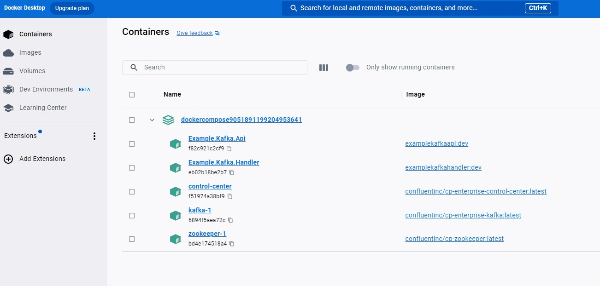
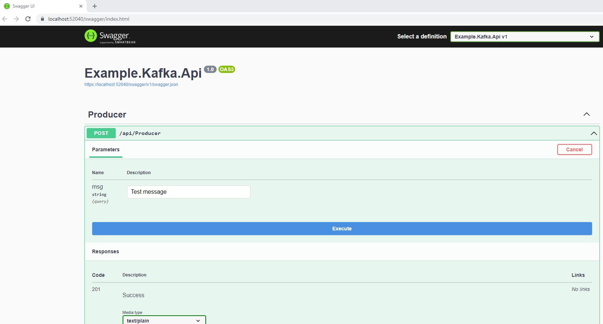
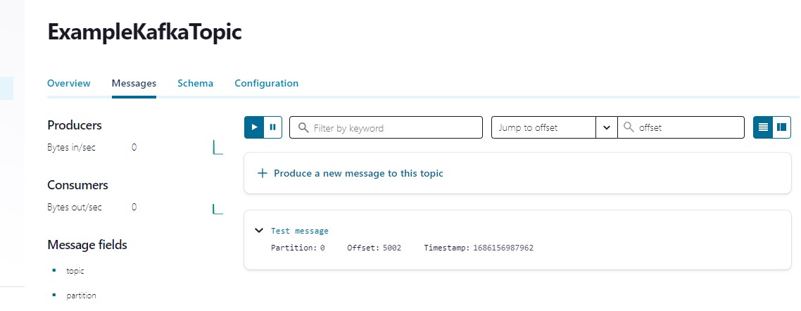
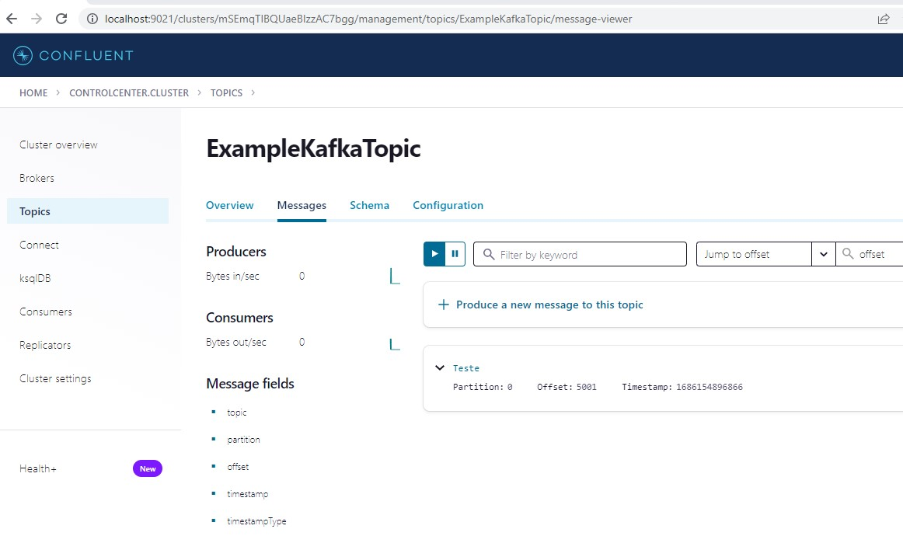

# Table of Contents

- [Introduction](#introduction)
  - [Technologies](#technologies)
- [Kafka](#kafka)
- [Comparison with Other Messaging Systems](#comparison-with-other-messaging-systems)
- [Example Project](#example-project)
  - [Example.Kafka.Handler](#examplekafkahandler)
  - [Example.Kafka.Api](#examplekafkaapi)
- [Docker Compose Configuration](#docker-compose-configuration)
- [Getting Started](#getting-started)
- [Contribution](#contribution)
- [License](#license)


## Introduction

This project serves as an example for developers who want to study and learn about Apache Kafka, Docker Compose, ASP.NET Core, ZooKeeper, Confluent Control Center, and the Confluent Platform.

### Technologies 

- Apache Kafka
- Docker Compose
- ASP.NET Core
- ZooKeeper
- Confluent Control Center
- Confluent Platform
- confluentinc/cp-zookeeper Docker image
- confluentinc/cp-enterprise-kafka Docker image
- confluentinc/cp-enterprise-control-center Docker image


#### Apache Kafka
Apache Kafka is a distributed event streaming platform that allows you to publish and subscribe to streams of records in a fault-tolerant, scalable manner. It provides a highly reliable and scalable messaging system for building real-time data pipelines and streaming applications.

#### Docker Compose
Docker Compose is a tool that allows you to define and run multi-container Docker applications. It simplifies the process of managing and orchestrating multiple containers, making it easier to set up and configure complex development environments.

#### ASP.NET Core
ASP.NET Core is a cross-platform, open-source framework for building modern, cloud-based web applications. It provides a powerful and flexible environment for developing web APIs and services using C#.

#### ZooKeeper
ZooKeeper is a centralized service for maintaining configuration information, naming, and providing distributed synchronization for distributed systems. In the context of this project, ZooKeeper is used for storing metadata and coordinating the activities of the Kafka brokers.

#### Confluent Control Center
Confluent Control Center is a web-based user interface that provides management and monitoring capabilities for Apache Kafka clusters. It allows you to easily monitor the health and performance of your Kafka deployment, track message flows, manage topics and partitions, and configure security settings.

#### Confluent Platform
Confluent Platform is a complete event streaming platform built on Apache Kafka. It provides additional features and tools to enhance the Kafka ecosystem, including connectors, stream processing capabilities, and schema management.

#### Docker Images
The project utilizes the following Docker images from Confluent Inc.:

- confluentinc/cp-zookeeper: The Docker image for running ZooKeeper as part of the Kafka ecosystem.
- confluentinc/cp-enterprise-kafka: The Docker image for running the Kafka broker and related components.
- confluentinc/cp-enterprise-control-center: The Docker image for running Confluent Control Center, providing a web-based interface for managing and monitoring Kafka clusters.


## Kafka

Kafka is a distributed streaming platform developed by Apache Software Foundation. It is designed to handle real-time data feeds and provides a scalable, fault-tolerant, and high-throughput messaging system. Kafka is widely used for building real-time streaming data pipelines and applications.

### Features

- **Scalability**: Kafka is designed to be highly scalable and can handle large amounts of data and high message throughput.
- **Distributed**: Kafka is designed to run on a cluster of machines, providing fault-tolerance and allowing for horizontal scalability.
- **Durability**: Kafka provides a durable message log that can store large amounts of data for a configurable retention period.
- **High Throughput**: Kafka is optimized for high message throughput and can handle thousands of messages per second.
- **Real-time**: Kafka is built for real-time data processing and can handle streaming data with low latency.
- **Publish-Subscribe Model**: Kafka follows a publish-subscribe model, where producers publish messages to topics, and consumers subscribe to topics to receive messages.

## Comparison with Other Messaging Systems

### RabbitMQ

- **Messaging Model**: RabbitMQ follows the Advanced Message Queuing Protocol (AMQP) and provides support for various messaging patterns, including point-to-point and publish-subscribe.
- **Ease of Use**: RabbitMQ has a straightforward setup process and provides a user-friendly interface for managing queues and exchanges.
- **Flexibility**: RabbitMQ supports a wide range of programming languages and platforms, making it suitable for diverse application environments.
- **Message Acknowledgment**: RabbitMQ provides built-in support for message acknowledgment, allowing consumers to acknowledge the successful processing of messages.

### Apache ActiveMQ

- **Protocols and APIs**: ActiveMQ supports multiple protocols and APIs, including AMQP, MQTT, STOMP, and OpenWire, providing flexibility in integrating with different systems.
- **Persistence**: ActiveMQ offers various persistence options, allowing messages to be stored in databases or file systems for durability.
- **JMS Support**: ActiveMQ fully supports the Java Message Service (JMS) API, making it a popular choice for Java-based applications.
- **Enterprise Features**: ActiveMQ provides features like message redelivery, dead-letter queues, and transaction support, which are beneficial for enterprise applications.

### Service Bus (Azure)

- **Managed Service**: Service Bus is a fully managed messaging service provided by Azure, offering high availability and scalability without the need for managing infrastructure.
- **Integration**: Service Bus integrates seamlessly with other Azure services, allowing for building robust and scalable cloud-based applications.
- **Message Queues and Topics**: Service Bus supports both message queues and topics/subscriptions, providing flexibility in building different messaging patterns.
- **Advanced Features**: Service Bus offers features like dead-letter queues, sessions, and temporal control for message expiration and time-based processing.

### AWS SQS (Simple Queue Service)

- **Managed Service**: SQS is a fully managed message queuing service provided by AWS, eliminating the need to manage infrastructure.
- **Scalability**: SQS automatically scales based on the volume of incoming messages, ensuring high availability and performance.
- **Message Retention**: SQS provides configurable message retention periods, allowing messages to be stored for a specific duration.
- **Visibility Timeout**: SQS supports a visibility timeout, allowing consumers to reserve a message for processing without other consumers receiving it.

Please note that the above comparison is a high-level overview and may not cover all aspects of each messaging system. It's important to consider specific use cases, requirements, and the overall ecosystem when choosing a messaging system for your project.

For more information on Kafka, you can visit the [official documentation](https://kafka.apache.org/documentation/).
For more information on RabbitMQ, you can visit the [official documentation](https://www.rabbitmq.com/documentation.html).
For more information on Apache ActiveMQ, you can visit the [official documentation](https://activemq.apache.org/documentation.html).
For more information on Azure Service Bus, you can visit the [official documentation](https://docs.microsoft.com/en-us/azure/service-bus/).
For more information on AWS SQS, you can visit the [official documentation](https://aws.amazon.com/sqs/).


## ZooKeeper

[ZooKeeper](https://zookeeper.apache.org/) is a centralized service for maintaining configuration information, naming, and providing distributed synchronization for distributed systems. It acts as a coordination service, ensuring consistency and reliability across the nodes of a distributed system. In the context of Apache Kafka, ZooKeeper is used for storing metadata and coordinating the activities of the Kafka brokers.

The `zookeeper` service in the Docker Compose configuration uses the `confluentinc/cp-zookeeper` Docker image, which provides a pre-configured ZooKeeper server. It exposes port `32181` on the host machine, which maps to the default ZooKeeper client port `32181` inside the container. The environment variables `ZOOKEEPER_CLIENT_PORT` and `ZOOKEEPER_TICK_TIME` are set to `32181` and `2000`, respectively.

## Confluent Control Center

[Confluent Control Center](https://www.confluent.io/confluent-control-center/) is a web-based user interface that provides management and monitoring capabilities for Apache Kafka clusters. It allows you to easily monitor the health and performance of your Kafka deployment, track message flows, manage topics and partitions, configure security settings, and more.

The `control-center` service in the Docker Compose configuration uses the `confluentinc/cp-enterprise-control-center` Docker image, which includes Confluent Control Center. It exposes port `9021` on the host machine, which maps to port `9021` inside the container. The service depends on the `zookeeper` and `kafka` services. The environment variables provided configure Control Center to connect to the Kafka cluster and ZooKeeper ensemble.


## Project Example.Kafka

This project demonstrates an example implementation using Docker Compose, ASP.NET Core, and Kafka. It consists of two projects: Example.Kafka.Handler and Example.Kafka.Api.


### Example.Kafka.Api

The Example.Kafka.Api project contains a controller named `ProducerController` that exposes an HTTP endpoint to produce messages to a Kafka topic.

#### ProducerController.cs

```csharp
[Route("api/[controller]")]
[ApiController]
public class ProducerController : ControllerBase
{
    [HttpPost]
    [ProducesResponseType(typeof(string), 201)]
    [ProducesResponseType(400)]
    [ProducesResponseType(500)]
    public IActionResult Post([FromQuery] string msg)
    {
        return Created("", SendMessageByKafka(msg));
    }

    private string SendMessageByKafka(string message)
    {
        var config = new ProducerConfig
        {
            BootstrapServers = "kafka:29092"
        };

        Produce("ExampleKafkaTopic", config, message);

        return string.Empty;
    }

    static void Produce(string topic, ClientConfig config, string message)
    {
        using (var producer = new ProducerBuilder<string, string>(config).Build())
        {
            var key = Guid.NewGuid().ToString();
            var val = message;
            Console.WriteLine($"Producing record: {key} {val}");

            producer.Produce(topic, new Message<string, string> { Key = key, Value = val },
                (deliveryReport) =>
                {
                    if (deliveryReport.Error.Code != ErrorCode.NoError)
                    {
                        Console.WriteLine($"Failed to deliver message: {deliveryReport.Error.Reason}");
                    }
                    else
                    {
                        Console.WriteLine($"Produced message to: {deliveryReport.TopicPartitionOffset}");
                    }
                });

            producer.Flush(TimeSpan.FromSeconds(10));

            Console.WriteLine($"The message was produced to topic {topic}");
        }
    }
}
```


### Example.Kafka.Handler

The Example.Kafka.Handler project contains a message handler class named `MessageHandler` that implements the `IHostedService` interface. It consumes messages from a Kafka topic and logs the received messages.

#### MessageHandler.cs

```csharp
public class MessageHandler : IHostedService
{
    private readonly ILogger _logger;

    public MessageHandler(ILogger<MessageHandler> logger)
    {
        _logger = logger;
    }

    public Task StartAsync(CancellationToken cancellationToken)
    {
        // Kafka consumer configuration
        var conf = new ConsumerConfig
        {
            GroupId = "test-consumer-group",
            BootstrapServers = "kafka:29092",
            AutoOffsetReset = AutoOffsetReset.Earliest
        };

        using (var c = new ConsumerBuilder<Ignore, string>(conf).Build())
        {
            c.Subscribe("ExampleKafkaTopic");
            var cts = new CancellationTokenSource();

            try
            {
                while (true)
                {
                    var message = c.Consume(cts.Token);
                    _logger.LogInformation($"Message: {message.Value} received from {message.TopicPartitionOffset}");
                }
            }
            catch (OperationCanceledException)
            {
                c.Close();
            }
        }

        return Task.CompletedTask;
    }

    public Task StopAsync(CancellationToken cancellationToken)
    {
        return Task.CompletedTask;
    }
}
```


## Docker Compose Configuration

The Docker Compose configuration file (`docker-compose.yml`) defines the services required to run the example project. It includes services for Kafka, ZooKeeper, Example.Kafka.Api, and Example.Kafka.Handler.

```yaml
version: '3.4'

services:
  example.kafka.api:
    # API service configuration

  example.kafka.handler:
    # Handler service configuration

  zookeeper:
    # ZooKeeper service configuration

  kafka:
    # Kafka service configuration

  control-center:
    # Control Center service configuration
```


The Docker Compose configuration file (`docker-compose.yml`) is used to define and manage the containers required for running the example project. The configuration includes the following services:

### example.kafka.api

This service represents the Example.Kafka.Api project. It is built from the Dockerfile located in the `src/Example.Kafka.Api` directory. The service exposes port `5000` on the host machine, which maps to port `80` inside the container. It depends on the following services: `zookeeper`, `kafka`, and `control-center`. The environment variables `KafkaConfiguration__Brokers` and `ASPNETCORE_ENVIRONMENT` are set to `'kafka:29092'` and `'Production'`, respectively.

### example.kafka.handler

This service represents the Example.Kafka.Handler project. It is built from the Dockerfile located in the `src/Example.Kafka.Handler` directory. The service exposes port `6000` on the host machine, which maps to port `81` inside the container. It depends on the following services: `zookeeper`, `kafka`, and `control-center`. The environment variables `KafkaConfiguration__Brokers` and `ASPNETCORE_ENVIRONMENT` are set to `'kafka:29092'` and `'Production'`, respectively.

### zookeeper

This service uses the `confluentinc/cp-zookeeper` Docker image to run ZooKeeper, which is a centralized service for maintaining configuration information, naming, and providing distributed synchronization. The service exposes port `32181` on the host machine, which maps to the default ZooKeeper client port `32181` inside the container. The environment variables `ZOOKEEPER_CLIENT_PORT` and `ZOOKEEPER_TICK_TIME` are set to `32181` and `2000`, respectively.

### kafka

This service uses the `confluentinc/cp-enterprise-kafka` Docker image to run Apache Kafka, which is a distributed streaming platform. The service exposes ports `9092` and `29092` on the host machine, which map to the corresponding Kafka ports inside the container. It depends on the `zookeeper` service. Various environment variables are set to configure Kafka, including `KAFKA_BROKER_ID`, `KAFKA_ZOOKEEPER_CONNECT`, `KAFKA_LISTENER_SECURITY_PROTOCOL_MAP`, `KAFKA_OFFSETS_TOPIC_REPLICATION_FACTOR`, `KAFKA_INTER_BROKER_LISTENER_NAME`, `KAFKA_LISTENERS`, `KAFKA_ADVERTISED_LISTENERS`, `KAFKA_AUTO_CREATE_TOPICS_ENABLE`, `KAFKA_METRIC_REPORTERS`, `CONFLUENT_METRICS_REPORTER_BOOTSTRAP_SERVERS`, `CONFLUENT_METRICS_REPORTER_ZOOKEEPER_CONNECT`, `CONFLUENT_METRICS_REPORTER_TOPIC_REPLICAS`, `CONFLUENT_METRICS_ENABLE`, and `CONFLUENT_SUPPORT_CUSTOMER_ID`.

### control-center

This service uses the `confluentinc/cp-enterprise-control-center` Docker image to run Confluent Control Center, which provides a web-based user interface for managing and monitoring Kafka clusters. The service exposes port `9021` on the host machine, which maps to port `9021` inside the container. It depends on the `zookeeper` and `kafka` services. Various environment variables are set to configure Control Center, including `CONTROL_CENTER_BOOTSTRAP_SERVERS`, `CONTROL_CENTER_ZOOKEEPER_CONNECT`, `CONTROL_CENTER_REPLICATION_FACTOR`, `CONTROL_CENTER_INTERNAL_TOPICS_PARTITIONS`, `CONTROL_CENTER_MONITORING_INTERCEPTOR_TOPIC_PARTITIONS`, `CONFLUENT_METRICS_TOPIC_REPLICATION`, and `PORT`.


## Getting Started

To run the project, make sure you have Docker and Docker Compose installed. Then, execute the following command in the project's root directory:

```bash
docker-compose up
```
### Docker Container

Docker Container:


### API

Example kafka Api:


### Confluent

Example kafka Api:



### Links



Confluent:

[http://localhost:9021/clusters/mSEmqTIBQUaeBIzzAC7bgg/management/topics/ExampleKafkaTopic/message-viewer](http://localhost:9021/clusters/mSEmqTIBQUaeBIzzAC7bgg/management/topics/ExampleKafkaTopic/message-viewer)


## Contribution
Contributions are welcome! If you find any issues or have suggestions for improvements, feel free to open an issue or submit a pull request.


## License:
This project is licensed under the [MIT License](#).

## References:

[Utilizando Kafka em suas aplicações AspNet Core](https://dev.to/marraia/utilizando-kafka-em-suas-aplicacoes-aspnet-core-2ieo)

[Confluent Inc. Github](https://github.com/confluentinc)
